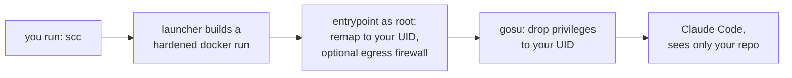

# scc: sandboxed Claude Code

[](https://github.com/SensitiveWebUser/Sandbox-Claude-Code/actions/workflows/ci.yml)


Run Claude Code inside an isolated Docker container, from any repo, with one command. `cd` into a project, type `scc`, and the agent runs against **that directory and nothing else on your machine**. You log in once, and Claude Code keeps itself up to date inside the sandbox (update scc itself with `scc self-update`).

> ⚠️ **Independent project, not affiliated with Anthropic.** `scc` is an unofficial community wrapper. It does **not** own, control, bundle, or represent Claude Code or Anthropic. It installs Anthropic's official CLI at runtime and simply runs it in a container. "Claude" and "Claude Code" are Anthropic's. Your use of Claude Code is governed by Anthropic's terms. Provided as-is, no warranty (see [License](#license)).

### At a glance

- **One command.** `cd repo && scc`. No config needed.
- **Only your repo is exposed by default.** Just the current directory is mounted. SSH keys, `$HOME`, and host credentials stay out. (The one default exception is the clipboard socket for image paste on Wayland, which you can disable, see below.)
- **Hardened by default.** `--cap-drop ALL` plus six caps, `no-new-privileges`, PID limit, no `sudo`, setuid bits stripped. `--hardened` adds a read-only rootfs and egress firewall.
- **Opt in when you need more.** A default-deny firewall, SSH-agent forwarding for signed commits, language toolchains, and named profiles, all off by default. In-chat image paste is the exception: on by default on Wayland, off with `--no-clipboard`.
- **Slim and current.** ~500 MB Debian-slim image. Claude Code auto-updates itself.

## Quick start

**Requirements** (Arch Linux shown, any Linux with Docker Engine works):

```bash
sudo pacman -Syu docker docker-buildx
sudo systemctl enable --now docker.service
sudo usermod -aG docker "$USER"   # then log out/in, or: newgrp docker
```

Membership in the `docker` group is root-equivalent on the host. That is a property of Docker itself, independent of this sandbox.

**Install** (downloads a pinned release, then runs the installer):

```bash
curl -fsSL https://raw.githubusercontent.com/SensitiveWebUser/Sandbox-Claude-Code/main/install-remote.sh | bash
```

Prefer to read before you run? Download it, read it, then run it:

```bash
curl -fsSL https://raw.githubusercontent.com/SensitiveWebUser/Sandbox-Claude-Code/main/install-remote.sh -o install-remote.sh
less install-remote.sh && bash install-remote.sh
```

**First run:**

```bash
scc login                   # one-time browser login, then /exit
cd ~/some/repo && scc       # first run pulls the published image (or builds locally), then daily use
```

The first `scc` pulls the prebuilt image from GHCR. If the pull fails (offline, or the package is private) it builds locally from the Dockerfile instead. To force a local build at any time, run `scc rebuild` (a few minutes).

`scc login` uses host networking so Claude Code's localhost OAuth callback works, and stores credentials in the `scc-home` volume for reuse. If browser login misbehaves, run `claude setup-token` where you have a browser and export `CLAUDE_CODE_OAUTH_TOKEN`. `scc` passes it through automatically.

## How it works



The image is `debian:bookworm-slim` plus git and a few tools, with Claude Code installed by Anthropic's official native installer as a non-root user (no Node.js runtime is needed, the CLI is a self-contained binary). A small entrypoint runs as root only long enough to remap the container user to your host UID/GID (so files the agent writes are owned by you, not root), fix ownership of the persisted home volume, and optionally raise the firewall, then drops privileges with `gosu`. Every run uses `--cap-drop ALL` plus only the six capabilities the entrypoint needs, `no-new-privileges`, a PID limit, and `--init`. There is no `sudo` in the image.

## Commands

Anything that is not a reserved subcommand is passed straight to `claude`.

| Command | What it does | Example |
|---|---|---|
| `scc [args...]` | Claude Code in the current repo (permission prompts on) | `scc "fix the failing tests"` |
| `scc yolo [args...]` | `--dangerously-skip-permissions`, firewall **on** by default | `scc yolo -c` |
| `scc shell [cmd...]` | A shell inside the sandbox, or run `cmd...` in it | `scc shell claude doctor` |
| `scc init` | Write a starter `.scc.conf` here (`--global` for the config file) | `scc init` |
| `scc login` | One-time browser login (persists in the home volume) | `scc login` |
| `scc update` | Update Claude Code (inside the sandbox) to the newest release | `scc update` |
| `scc self-update` | Update scc itself (version-aware; `--check`, `-y`) | `scc self-update --check` |
| `scc rebuild` | Rebuild the image locally (alias: `scc build`) | `scc rebuild` |
| `scc profiles` | List the home-volume profiles that exist | `scc profiles` |
| `scc trust` | Trust this repo's `.scc.conf` so scc will honor it | `scc trust` |
| `scc uninstall` | Remove scc (add `--all` to also drop the volume + image) | `scc uninstall --all` |
| `scc version` | Print scc's own version | `scc version` |
| `scc help` | Show usage | `scc help` |

## Flags

| Flag | Scope | What it does | Example |
|---|---|---|---|
| `--profile NAME` | global (before the subcommand) | Use a separate home volume (`scc-home-NAME`) for isolated login/state | `scc --profile work login` |
| `--hardened` | run | Read-only rootfs + `tmpfs` + firewall on (max lockdown) | `scc --hardened "review this repo"` |
| `--ssh-agent` | run | Forward your SSH agent so in-sandbox git can sign and push (key stays on the host) | `scc --ssh-agent "commit and push"` |
| `--with LIST` | run | Add toolchains for this run (`gh`, `go`, `node`, `python`, `rust`) | `scc --with python,rust "port it"` |
| `--clipboard` / `--no-clipboard` | run | Forward the host clipboard for in-chat image paste. On by default on Wayland | `scc --no-clipboard` |
| `--screenshots[=DIR]` | run | Read-only mount a screenshots dir so you can reference images outside the repo | `scc --screenshots "check ~/Pictures/bug.png"` |

Run flags go before the `claude` args. The global `--profile` goes before the subcommand.

## Configuration

Everything works with zero configuration. For defaults that stick, drop a `key = value` file at `~/.config/scc/config` (override the path with `$SCC_CONFIG`). It is parsed with a fixed key allowlist and never executed as code.

| Key | Example | Meaning |
|---|---|---|
| `image` | `ghcr.io/…:latest` | Image to run (default: the published GHCR image; falls back to a local build) |
| `volume` | `scc-home` | Home-volume name (login + Claude install) |
| `pids_limit` | `4096` | PID cap (fork-bomb guard) |
| `firewall` | `auto` | Default egress firewall: `auto` (off, on for `yolo`), `on`, or `off`. `--hardened` and a trusted project can force it on |
| `extra_domains` | `crates.io,static.crates.io` | Extra domains the firewall allows |
| `docker_args` | `--memory 8g` | Raw arguments appended to `docker run` |
| `profile` | `work` | Default profile |
| `toolchains` | `python,node` | Default toolchains to layer in (`--with` adds to this) |
| `clipboard` | `auto` | In-chat image paste: `auto` (Wayland only), `on` (Wayland), or `off`. X11 needs the explicit `--clipboard` flag |

```ini
# ~/.config/scc/config
firewall      = auto
toolchains    = python
extra_domains = crates.io,static.crates.io
```

Values resolve as **built-in defaults < config file < project file < environment < CLI flags** (later wins), so a one-off `SCC_FIREWALL=1 scc` still overrides everything.

### Environment variables

| Variable | Effect |
|---|---|
| `SCC_FIREWALL=1\|0` | Force the egress firewall on/off (default: off for `scc`, on for `scc yolo`) |
| `FIREWALL_EXTRA_DOMAINS=a.com,b.org` | Extra domains the firewall allows |
| `SCC_DOCKER_ARGS="..."` | Extra arguments appended to `docker run` |
| `SCC_IMAGE`, `SCC_VOLUME`, `SCC_PIDS_LIMIT` | Override the matching config keys for one run |
| `SCC_TOOLCHAINS=python,node` | Default toolchains (like the config key; `--with` adds to it) |
| `SCC_PROFILE=work` | Select a profile (like `--profile`) |
| `SCC_CLIPBOARD=auto\|on\|off` | Clipboard image paste (see the config `clipboard` key) |
| `SCC_ALLOW_ANY_DIR=1` | Permit running from `$HOME` or `/` (not advised) |
| `SCC_ALLOW_ROOT=1` | Permit running as host root (the agent would run as uid 0; not advised) |
| `SCC_SKIP_OS_CHECK=1` | Skip the operating-system support check |
| `SCC_TRUST_PROJECT=1` | Honor a repo's `.scc.conf` for this run only (automation; not recorded) |
| `SCC_CONFIG=path` | Use a different config-file path |
| `SCC_REPO=owner/repo`, `SCC_VERSION=vX.Y.Z` | Repo/tag for `self-update` and the installer |
| `CLAUDE_CODE_OAUTH_TOKEN=...` | Passed through when set (login fallback) |

---

## Details

### Images and clipboard

Claude Code takes images three ways: a **file path** in your prompt, **drag-and-drop**, and **clipboard paste** (Ctrl+V). Here is how each behaves in the sandbox:

- **File path** works for any image inside your repo (the mounted directory), for example `analyze ./design.png`. This works on every platform, always.
- **Clipboard paste (Ctrl+V)** is on by default on **Wayland**. scc forwards the host Wayland clipboard socket into the container (guarded, so it is a silent no-op when you are not on Wayland) and the image pastes straight into the chat. Turn it off with `--no-clipboard` or `clipboard = off`, and `--hardened` turns it off automatically.
  - **X11** is forwarded only when you pass `--clipboard` explicitly, because X11 gives any client access to the whole display. A warning is printed, and you may also need to allow the container with `xhost +si:localuser:$USER` (X access control), otherwise the in-container tool cannot authenticate. Wayland is preferred.
  - **macOS and Windows**: the Docker VM cannot reach the host clipboard, so paste does not work there. Use a file path or `--screenshots`.
- **Images outside the repo**: `--screenshots[=DIR]` read-only mounts a directory (default `~/Pictures` on Linux, `~/Desktop` on macOS) so you can reference shots that live outside the project, for example `scc --screenshots "what is wrong in ~/Pictures/error.png?"`.

The clipboard tools (`wl-clipboard`, `xclip`) are baked into the image, so no rebuild is needed.

**Tradeoff, by design:** default-on clipboard forwarding is the one host mount scc adds by default, because pasting screenshots is a core part of using Claude Code. The forwarded socket is a channel to your host clipboard, so a run can read what you copy while it is active. If that matters for a given session (an untrusted repo, sensitive clipboard contents), turn it off with `--no-clipboard`, set `clipboard = off` in your config to default it off, or use `--hardened` (which disables it along with the rest).

### Egress firewall

Interactive runs default to full network access. `scc yolo` defaults to a default-deny allowlist, because an agent that skips permission prompts should not also have unrestricted egress. Force it either way with `SCC_FIREWALL=1` or `SCC_FIREWALL=0`.

Allowed out of the box: DNS (only to the resolvers in the container's `resolv.conf`), GitHub's published IP ranges, Anthropic/Claude endpoints (`api.anthropic.com`, `claude.ai`, `statsig.anthropic.com`), Claude Code's telemetry/error endpoints (`statsig.com`, `sentry.io`), the npm registry, and PyPI (`registry.npmjs.org`, `pypi.org`, `files.pythonhosted.org`). The exact list is the `ALLOWED_DOMAINS` line in [`init-firewall.sh`](./init-firewall.sh). Add more with `FIREWALL_EXTRA_DOMAINS=crates.io,static.crates.io scc yolo`. Two honest limits: domains are resolved to IPs once at container start, so a CDN rotating addresses mid-session can break an allowed host (restart to refresh), and DNS itself remains a narrow exfiltration side channel.

### Hardened mode

The image already drops all Linux capabilities bar the few the entrypoint needs, runs with `no-new-privileges`, and ships with setuid/setgid bits stripped. For a stricter run, add `--hardened`:

```bash
scc --hardened "review this untrusted repo"
```

It makes the container's root filesystem **read-only** (only your repo, the home volume, and small `tmpfs` mounts stay writable) and turns the egress firewall **on**. It is opt-in because it can restrict what an agent may write or reach. Under a read-only rootfs the entrypoint runs as your numeric host UID directly (no `/etc/passwd` edit needed), with no private keys or extra host state involved.

### Signing and pushing (`--ssh-agent`)

By default the sandbox holds no keys, so commit signing is disabled and pushing is not authenticated. `scc --ssh-agent` forwards your **SSH agent** into the container so in-sandbox git can sign commits and push. Your private key never enters the sandbox. The agent, on the host, performs the signing. If SSH commit signing is configured, only your **public** signing key is mounted. Requires a running agent (check with `ssh-add -l`). Off by default. It announces itself when active and fails with a clear message if no agent is present. Plain git already works without it. The flag is named for what it adds.

GitHub CLI support is a toolchain: `scc --with gh` installs `gh` and passes your host `gh` token in as `GH_TOKEN` (see [Language toolchains](#language-toolchains)).

### Language toolchains

The base image is deliberately slim (no language runtimes beyond what Claude Code needs). Add them per run with `--with`, as opt-in layers built on top of the base:

```bash
scc --with python,rust "port this module"
scc --with node "debug the test runner"
```

Known toolchains: `gh`, `go`, `node`, `python`, `rust`. The first `--with` for a given combination builds a layered image (`scc:tc-<combo>`) and caches it. Later runs reuse it instantly. Toolchains install into system paths, so they are not shadowed by the home volume. The `gh` toolchain also passes your host `gh` token into the sandbox as `GH_TOKEN` (by name, never in a process list), so the agent can drive the GitHub CLI. No `gh` config is mounted, and if the host `gh` is unauthenticated, `gh` is simply unauthenticated inside. Set a default with `toolchains = python` in the config file. (Note: on Debian, `pip install` into the system Python is refused by PEP 668. Use a virtualenv, which is why `python3-venv` is included.)

### Profiles

Each login and Claude Code install lives in a Docker home volume, `scc-home` by default. `--profile NAME` switches to a separate one (`scc-home-NAME`), so you can keep, for example, work and personal logins apart:

```bash
scc --profile work login         # log in on the 'work' profile
scc --profile work "fix tests"   # run against it
scc profiles                     # list profiles (the active one is marked)
docker volume rm scc-home-work   # reset a profile
```

`--profile` is a global flag: put it before the subcommand, since it applies to every command including `login`. Set a default with `profile = work` in the config file.

### Per-project config (`.scc.conf`)

A repo can carry a `.scc.conf` so it "just works" for anyone who clones it. Because a cloned repo is **untrusted input**, scc treats it carefully:

- It is **ignored until you trust it.** An interactive run shows the file and asks. A non-interactive run ignores it. `scc trust` (after you have read it) records its checksum so it is honored from then on. Editing the file re-triggers the prompt.
- It may set only a **tiny, safe subset**: `toolchains`, and `firewall` (which it may only turn **on**). It can never set `image`, `volume`, `docker_args`, mounts, or widen egress, so a hostile repo cannot loosen the sandbox.

Scaffold one with `scc init`: it writes a commented `.scc.conf` here and trusts it for you (collaborators who clone still get the trust prompt). `scc init --global` scaffolds the global config file instead.

```ini
# .scc.conf committed in a repo
toolchains = python,node
firewall   = on
```

### Staying up to date

Two things update independently: **Claude Code** (inside the sandbox) and **scc** (the launcher).

Claude Code, strongest first: its native install auto-updates in the background into the persisted volume, so ordinary use keeps you current. `scc update` forces the newest release right now, and `scc rebuild` refreshes the base image and the baked-in install (used by fresh volumes). For reproducibility instead of freshness, pin a version in the Dockerfile (`... install.sh | bash -s -- <version>`) and add `ENV DISABLE_AUTOUPDATER=1`.

scc itself: `scc self-update` compares your installed version against the latest GitHub release and, if newer, reinstalls it (fetching the installer from the resolved release tag, never a moving branch, and downloading the matching pinned tarball). It shows what it will change and prompts first; `--check` previews without changing anything and `-y` skips the prompt. Afterwards it refreshes the image (pulls the registry image, or reminds you to `scc rebuild` a local one) so image-side fixes take effect. Pin a specific release with `SCC_VERSION=vX.Y.Z scc self-update`. See your version with `scc version`.

### What the sandbox can and cannot touch

**Mounted in:** the current directory (read-write, same path as on the host), your `~/.gitconfig` (read-only, so commits carry your name, and signing is disabled unless you pass `--ssh-agent`), and the `scc-home` volume holding Claude's install and credentials. **Passed through:** `TERM`, `COLORTERM`, `CLAUDE_CODE_OAUTH_TOKEN` if set, and (only when you opt in) `GH_TOKEN` with `--with gh` and a forwarded clipboard socket for image paste.

**Not shared:** SSH keys, the rest of your home directory, your shell environment, host credentials of any kind. Opt-in exceptions are explicit: `--ssh-agent` (agent socket), `--with gh` (a GitHub token), `--screenshots` (a read-only directory), and clipboard forwarding for image paste. The launcher also refuses to run from `$HOME` or `/`, since mounting those would defeat the point.

**Escape hatch:** `SCC_DOCKER_ARGS` appends raw arguments to `docker run` (extra mounts, `--memory 8g`, ports for a dev server, and so on).

### Troubleshooting

- **Login never completes in the browser:** use `scc login` (host networking), not a normal `scc` run. Fallback is `claude setup-token` + `CLAUDE_CODE_OAUTH_TOKEN`.
- **Containers can't resolve DNS:** put `{"dns": ["1.1.1.1", "9.9.9.9"]}` in `/etc/docker/daemon.json` and restart docker (a known quirk on some Arch setups).
- **`docker: permission denied`:** you have not re-logged-in after joining the `docker` group.
- **A firewalled run can't reach a host it needs:** add it to `FIREWALL_EXTRA_DOMAINS`.
- **Weird terminal rendering:** try `TERM=xterm-256color scc`.
- **Diagnostics from inside:** `scc shell`, then `claude doctor`.

### Honest limits

A container is a strong boundary for this purpose, but it is not a VM: the kernel is shared, so treat `scc` as protection against a misbehaving agent, not against a determined kernel exploit. `yolo` mode is *bounded*, not neutralized: within the mounted repo and whatever network you allow it, the agent can still do real things (edit files, commit, hit APIs), so review diffs before pushing. The one-time login and first build need normal network access. Everything after that is fast.

### Development

The launcher is modular pure Bash (no runtime dependencies): a thin `scc` dispatcher sourcing `lib/` (`ui`, `common`, `config`, `firewall`, `docker`, `toolchains`, `project`) and one file per subcommand under `lib/commands/`. Running the repo's `./scc` uses that `lib/` directly, so launcher edits take effect without reinstalling. Only image changes (`Dockerfile`, `docker/toolchains/`, `entrypoint.sh`, `init-firewall.sh`) need `./install.sh && scc rebuild`.

Tests are [`bats`](https://github.com/bats-core/bats-core) and stub `docker`, asserting on the assembled `docker run` argv, so the security invariants (capability set, mount set, firewall mode) are checked without a real container:

```bash
shellcheck -x scc lib/*.sh lib/commands/*.sh install.sh install-remote.sh \
  entrypoint.sh init-firewall.sh docker/toolchains/install.sh
bats tests
```

CI runs shellcheck + bats, a `docker build` with base and hardened runtime smoke tests, and a matrix that builds and smoke-tests each toolchain layer. Contributions follow the [CLA](./CLA.md). Build rules live in [AGENTS.md](./AGENTS.md).

**Releasing:** bump the `VERSION` file to the new version in the release commit, then push a matching `vX.Y.Z` tag. The release workflow verifies `VERSION` equals the tag (so an installed copy reports its real version), builds and pushes the GHCR image, and cuts the GitHub release.

## License

`scc` is **source-available**, not "open source" in the OSI sense. It is licensed under the [PolyForm Noncommercial License 1.0.0](./LICENSE):

- ✅ **Free for any noncommercial use:** personal projects, study, research, hobby, nonprofits, education, government. Use it, modify it, share it.
- 💼 **Commercial use requires a separate license** from the copyright holder, who retains all commercial rights.
- 📝 It comes **as-is, with no warranty** (see the license text).

Contributions are welcome under the [Contributor License Agreement](./CLA.md), which keeps the project's commercial rights with the owner while you retain ownership of your own work.

## Not affiliated with Anthropic

`scc` is independent and unofficial. It is not endorsed by, sponsored by, or partnered with Anthropic, and it does not own or control Claude Code. It installs and runs Anthropic's official CLI without modification. Trademarks belong to their respective owners.
